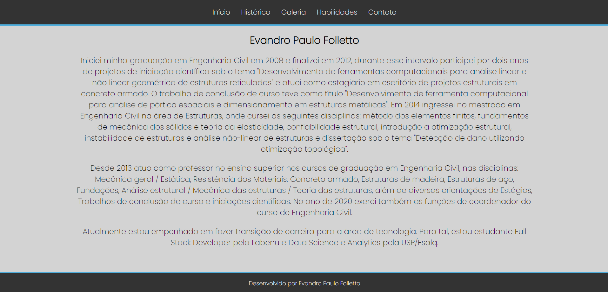

# `Projeto`
Projeto Portfólio

# `Link`
[Clique aqui para acessar](https://folletto-portfolio.surge.sh/index.html)

# `Descrição`
[Projeto desenvolvido na semana 4 do curso Labenu]  
O Projeto Portfólio foi desenvolvido dentro do curso Full-Stack Web Developer da Labenu, o qual consiste em criações de páginas simples, utilizando apenas HTML e CSS para tal. O site é comporto por cinco páginas, que podem ser acessadas através de um menu horizontal superior:  
**- Página Início:** contém uma imagem do desenvolvedor do projeto, assim como imagens das instituições de ensino em que o mesmo estudou, sendo possível clicar nas mesmas e ser redirecionado para o site das mesmas.  
**- Página Histórico:** contém uma descrição do histórico profissional do autor.  
**- Página Galeria:** contém alguns projetos desenvolvidos pelo autor, dentro do próprio bootcamp da Labenu. É possível acessar os detalhes destes projetos clicando no botão "Detalhar".  
**- Página Habilidades:** contém uma descrição das habilidades do autor.  
**- Página Contato:** contém um formulário (sem a funcionalidade de enviar) e também as redes sociais

# `Modo de usar`
Ao iniciar a aplicação o usuário é direcionado para a tela de Login. Nesta tela, o usuário pode efetuar seu login ou então se inscrever na plataforma, criando um usuário com nome, email, senha e dados de endereço.
 
Após efetuar login, o usuário é redirecionado para a página de feed, onde poderá escolher entre diferentes tipos de restaurantes, podendo filtrar por palavras chave (utilizando para o tal o campo de buscas) ou por tipos de comidas, na barra superior. Dentre as opções estão por exemplo comida Asiática, Hamburgueres, Italiana, Sorvetes entre outros.
 
Clicando sobre a imagem de um restaurante no feed, o usuário é redicionado para a página de detalhes detes, onde são listados todos os alimentos fornecidos pelo estabelecimento, podendo o usuário adicionar e remover produtos para o seu carrinho.
 
Na parte inferior existe um menu, onde o usuário pode acessar a página de carrinho e verificar todos os itens que adicionou ao mesmo, valor do frente e total da compra, além de selecionar um método de pagamento. Também é possível remover itens da lista. Ao clicar em confirmar, será exibida uma mensagem de pedido realizado com sucesso.
 
No menu inferior, o usuário pode clicar no ícone de perfil e então será redirecionado para a página de perfil do usuário, onde pode alterar seus dados cadastrais e de endereço, e ainda verificar o seu histórico de pedidos. No canto superior direito da página, é possível também fazer o logout da conta, sendo então redirecionado para a página de login.

# `Tecnologias utilizadas`

# `Autor`
Evandro Paulo Folletto
 
  
 

# `Imagens`
### Página Inicial/Home

### Página Histórico

### Página Galeria

### Página Detalhes

### Página Habilidades

### Página Contato

